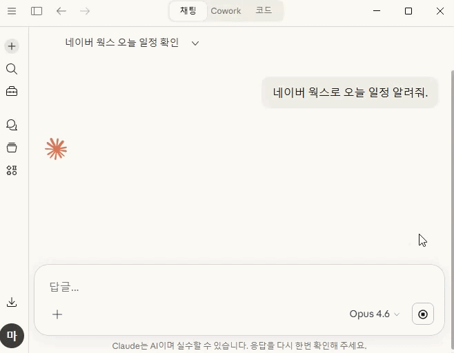

# nworks

[](https://www.npmjs.com/package/nworks)
[](LICENSE)
[](https://www.npmjs.com/package/nworks)
[](https://glama.ai/mcp/servers/yjcho9317/nworks)

Featured in [awesome-mcp-servers](https://github.com/punkpeye/awesome-mcp-servers)

[🇺🇸 English](README.md) | [🇰🇷 한국어](README.ko.md) | 🇯🇵 日本語

<p align="center">
  
</p>

LINE WORKS (NAVER WORKS) 初のMCPサーバー。
メッセージ、カレンダー、ドライブ、メール、タスク、掲示板 — 26ツール対応のCLI + MCPサーバーです。

## クイックスタート

```bash
npm install -g nworks
nworks login --user
nworks calendar list
```

### AIエージェントの使用例

```
ユーザー: 今日の予定を教えて

Claude → nworks_calendar_list
  → 3件: スタンドアップ(10:00)、ランチミーティング(12:00)、コードレビュー(15:00)

ユーザー: チームチャンネルにデプロイ完了メッセージを送って

Claude → nworks_message_send
  { "channel": "C001", "text": "v1.2.0 デプロイ完了" }
  → メッセージが送信されました

ユーザー: 未読メールを確認して要約して

Claude → nworks_mail_list (unread)
  → 未読メール3件
Claude → nworks_mail_read (各)
  → "3件: 1) CTOからのデプロイ承認, 2) 金曜日のミーティング招待, 3) 週次レポートリマインダー"
```

## インストール

```bash
npx nworks             # 直接実行
npm install -g nworks  # グローバルインストール
```

## ログイン

```bash
# User OAuth（カレンダー、ドライブ、メール、タスク、掲示板）
nworks login --user --scope "calendar calendar.read file file.read mail mail.read task task.read board board.read user.read"

# ボットメッセージ送信が必要な場合（Service Account）
nworks login

# 認証状態の確認
nworks whoami

# ログアウト
nworks logout
```

> `nworks login --user` にはCLIENT_IDとCLIENT_SECRETのみ必要です。環境変数や既存の設定に値がある場合は再入力を求めません。

> **Developer Console設定**: User OAuthを使用するには、[Developer Console](https://dev.worksmobile.com/jp/)でRedirect URLに `http://localhost:9876/callback` を登録してください。

---

## AIエージェント連携（MCPサーバー）

Claude Desktop、Cursorなど、MCP対応クライアントから利用できます。

### セットアップ

まずログインします：

```bash
nworks login --user --scope "calendar calendar.read file file.read mail mail.read task task.read board board.read user.read"
```

次にMCP設定に追加します（`~/.config/claude/claude_desktop_config.json`）：

```json
{
  "mcpServers": {
    "nworks": {
      "command": "nworks",
      "args": ["mcp"]
    }
  }
}
```

一度のログインで26ツールすべて利用可能。追加のenv設定は不要です。

> CLIログインなしでも、AIエージェントが `nworks_setup` → `nworks_login_user` を呼び出せばブラウザから直接認証できます。Client SecretとPrivate Keyのパスは、MCP設定の `env` フィールドまたはシステム環境変数で事前に設定してください。

### MCPツール一覧（26個）

| ツール | 説明 | 必要な認証 |
|--------|------|-----------|
| **設定/認証** | | |
| `nworks_setup` | API認証情報の設定（Client IDなど）。Client Secretは環境変数で設定 | — |
| `nworks_login_user` | User OAuthブラウザログイン（全scope自動含む） | — |
| `nworks_logout` | 認証情報とトークンの削除 | — |
| `nworks_whoami` | 認証状態の確認 | — |
| `nworks_doctor` | 接続診断（認証、トークン、APIヘルスチェック） | — |
| **メッセージ** | | |
| `nworks_message_send` | ユーザー/チャンネルにメッセージ送信 | Service Account |
| `nworks_message_members` | チャンネルメンバー一覧 | Service Account |
| `nworks_directory_members` | 組織メンバー一覧 | Service Account |
| **カレンダー** | | |
| `nworks_calendar_list` | カレンダー予定の一覧 | User OAuth (calendar.read) |
| `nworks_calendar_create` | カレンダー予定の作成 | User OAuth (calendar + calendar.read) |
| `nworks_calendar_update` | カレンダー予定の更新 | User OAuth (calendar + calendar.read) |
| `nworks_calendar_delete` | カレンダー予定の削除 | User OAuth (calendar + calendar.read) |
| **ドライブ** | | |
| `nworks_drive_list` | ドライブのファイル/フォルダ一覧 | User OAuth (file.read) |
| `nworks_drive_upload` | ドライブにファイルアップロード | User OAuth (file) |
| `nworks_drive_download` | ドライブからファイルダウンロード（5MB超はローカル保存） | User OAuth (file.read) |
| **メール** | | |
| `nworks_mail_send` | メール送信 | User OAuth (mail) |
| `nworks_mail_list` | メールボックス一覧 | User OAuth (mail.read) |
| `nworks_mail_read` | メール詳細表示 | User OAuth (mail.read) |
| **タスク** | | |
| `nworks_task_list` | タスク一覧 | User OAuth (task.read) |
| `nworks_task_create` | タスク作成 | User OAuth (task + user.read) |
| `nworks_task_update` | タスク更新/完了 | User OAuth (task + user.read) |
| `nworks_task_delete` | タスク削除 | User OAuth (task + user.read) |
| **掲示板** | | |
| `nworks_board_list` | 掲示板一覧 | User OAuth (board.read) |
| `nworks_board_posts` | 掲示板の投稿一覧 | User OAuth (board.read) |
| `nworks_board_read` | 掲示板の投稿詳細 | User OAuth (board.read) |
| `nworks_board_create` | 掲示板に投稿作成 | User OAuth (board) |

### AIエージェント使用例

```
ユーザー: 明日14時にミーティングを入れて、チームチャンネルに知らせて

Claude → nworks_calendar_create
  { "summary": "ミーティング", "start": "2026-03-15T14:00:00", "end": "2026-03-15T15:00:00" }
  → 予定が作成されました

Claude → nworks_message_send
  { "channel": "C001", "text": "明日14:00にミーティングが設定されました" }
  → メッセージが送信されました

ユーザー: 未読メールを確認して要約して

Claude → nworks_mail_list (unread)
  → 未読メール3件
Claude → nworks_mail_read (各)
  → "3件: 1) CTOからのデプロイ承認, 2) 金曜日のミーティング招待, 3) 週次レポートリマインダー"
```

---

## CLIの使い方

> すべてのコマンドで `--json` に対応（パイプ、スクリプト、エージェント解析に便利）。`message send`、`mail send`、`drive upload` は `--dry-run` で実際の送信なしにテスト可能。

### メッセージ（Bot API）

```bash
# ユーザーにテキストメッセージ
nworks message send --to <userId> --text "メッセージ"

# チャンネルにテキストメッセージ
nworks message send --channel <channelId> --text "お知らせ"

# ボタンメッセージ
nworks message send --to <userId> --type button --text "PRレビュー依頼" \
  --actions '[{"type":"message","label":"承認","postback":"approve"}]'

# リストメッセージ
nworks message send --to <userId> --type list --text "今日のタスク" \
  --elements '[{"title":"コードレビュー","subtitle":"PR #382"}]'

# チャンネルメンバー一覧
nworks message members --channel <channelId>
```

### 組織（Directory API）

```bash
nworks directory members   # 組織メンバー一覧
```

### カレンダー（User OAuth）

```bash
# 今日の予定一覧
nworks calendar list

# 期間指定
nworks calendar list --from "2026-03-14T00:00:00+09:00" --until "2026-03-14T23:59:59+09:00"

# 予定の作成
nworks calendar create --title "ミーティング" --start "2026-03-14T14:00+09:00" --end "2026-03-14T15:00+09:00"

# 場所/説明付き
nworks calendar create --title "ランチ" --start "2026-03-14T12:00+09:00" --end "2026-03-14T13:00+09:00" \
  --location "会議室" --description "四半期レビュー"

# 参加者指定 + 通知
nworks calendar create --title "チームミーティング" --start "2026-03-14T10:00+09:00" --end "2026-03-14T11:00+09:00" \
  --attendees "user1@example.com,user2@example.com" --notify

# 予定の更新
nworks calendar update --id <eventId> --title "変更後のタイトル"

# 予定の削除
nworks calendar delete --id <eventId>
```

### ドライブ（User OAuth）

```bash
# ファイル/フォルダ一覧
nworks drive list

# ファイルアップロード
nworks drive upload --file ./report.pdf

# 特定フォルダにアップロード
nworks drive upload --file ./report.pdf --folder <folderId>

# ファイルダウンロード
nworks drive download --file-id <fileId>

# 出力先/ファイル名指定
nworks drive download --file-id <fileId> --out ./downloads --name report.pdf
```

### メール（User OAuth）

```bash
# メール送信
nworks mail send --to "user@example.com" --subject "件名" --body "本文"

# CC/BCC付き
nworks mail send --to "user@example.com" --cc "cc@example.com" --subject "件名" --body "本文"

# 受信トレイ一覧
nworks mail list

# 未読のみ
nworks mail list --unread

# メール詳細表示
nworks mail read --id <mailId>
```

### タスク（User OAuth）

```bash
# タスク一覧
nworks task list

# 未完了のみ
nworks task list --status TODO

# タスク作成
nworks task create --title "コードレビュー" --body "PR #382 レビュー"

# 期限付き
nworks task create --title "デプロイ" --due 2026-03-20

# 完了にする
nworks task update --id <taskId> --status done

# タスク削除
nworks task delete --id <taskId>
```

### 掲示板（User OAuth）

```bash
# 掲示板一覧
nworks board list

# 投稿一覧
nworks board posts --board <boardId>

# 投稿詳細
nworks board read --board <boardId> --post <postId>

# 投稿作成
nworks board create --board <boardId> --title "お知らせ" --body "内容"

# 通知付き + コメント無効化
nworks board create --board <boardId> --title "通知" --body "内容" --notify --no-comment
```

### CI/CDデプロイ通知

```bash
# GitHub Actionsでデプロイ完了後、チームチャンネルに通知
nworks message send --channel $CHANNEL_ID --text "v${VERSION} デプロイ完了"
```

### チーム自動化スクリプト

```bash
# 毎朝チームメンバーにリマインダー送信
for userId in $(nworks directory members --json | jq -r '.users[].userId'); do
  nworks message send --to "$userId" --text "本日のスタンドアップは10時です"
done
```

---

## OAuth Scope設定

[LINE WORKS Developer Console](https://dev.worksmobile.com/jp/)でアプリのOAuth Scopeを追加してください。

| Scope | 用途 | 認証方式 | 必要なコマンド |
|-------|------|---------|---------------|
| `bot` | Botメッセージ送信 | Service Account | `message send` |
| `bot.read` | Botチャンネル/メンバー取得 | Service Account | `message members` |
| `calendar` | カレンダー書き込み | User OAuth | `calendar create/update/delete`（calendar.readも必要） |
| `calendar.read` | カレンダー読み取り | User OAuth | `calendar list`、カレンダー書き込みの依存関係 |
| `file` | ドライブ読み書き | User OAuth | `drive list/upload/download` |
| `file.read` | ドライブ読み取り専用 | User OAuth | `drive list/download` |
| `mail` | メール読み書き | User OAuth | `mail send/list/read` |
| `mail.read` | メール読み取り専用 | User OAuth | `mail list/read` |
| `task` | タスク読み書き | User OAuth | `task create/update/delete`（user.readも必要） |
| `task.read` | タスク読み取り専用 | User OAuth | `task list` |
| `user.read` | ユーザー情報取得 | Service Account / User OAuth | `directory members`、タスク書き込みの依存関係 |
| `board` | 掲示板読み書き | User OAuth | `board list/posts/read/create` |
| `board.read` | 掲示板読み取り専用 | User OAuth | `board list/posts/read` |

> **ヒント**: scopeを変更した後はトークンを再発行してください。
> ```bash
> nworks logout && nworks login --user --scope "..."
> ```

---

## 環境変数

環境変数で認証情報を設定すると、`nworks login` なしで利用できます（CI/エージェント向け）。

```bash
# 必須
NWORKS_CLIENT_ID=
NWORKS_CLIENT_SECRET=

# ボットメッセージ送信時のみ必要（User OAuthのみなら不要）
NWORKS_SERVICE_ACCOUNT=
NWORKS_PRIVATE_KEY_PATH=
NWORKS_BOT_ID=

# オプション
NWORKS_DOMAIN_ID=
NWORKS_SCOPE=              # デフォルト: bot bot.read user.read
NWORKS_VERBOSE=1           # デバッグログ
```

### MCPサーバーに環境変数を直接設定

機密情報（Client Secret、Private Keyパス）はMCP設定の `env` フィールドで設定します。Client IDなどの非機密情報は、AIエージェントが `nworks_setup` ツールで直接設定できます。

```json
{
  "mcpServers": {
    "nworks": {
      "command": "npx",
      "args": ["-y", "nworks", "mcp"],
      "env": {
        "NWORKS_CLIENT_SECRET": "<Client Secret>",
        "NWORKS_PRIVATE_KEY_PATH": "<Private Keyファイルの絶対パス（Service Account使用時）>"
      }
    }
  }
}
```

---

## License

Apache-2.0
